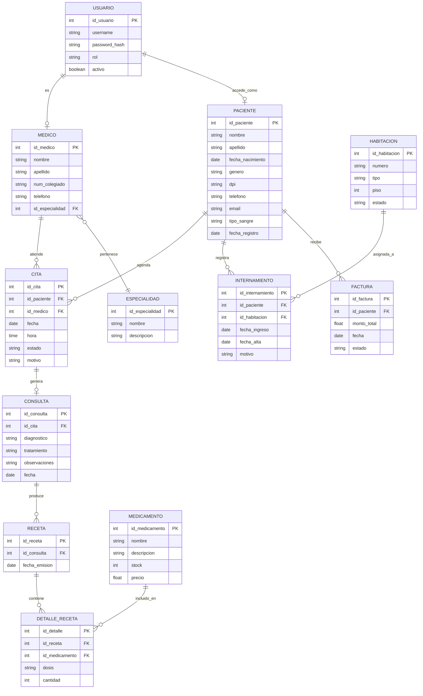

# Diseño ER — Sistema de Gestión Hospitalaria

## 1. Entidades

- **Paciente**: id_paciente (PK), nombre, apellido, fecha_nacimiento, genero, dpi, telefono, email, direccion, tipo_sangre, contacto_emergencia, fecha_registro
- **Medico**: id_medico (PK), nombre, apellido, num_colegiado, telefono, email, id_especialidad (FK)
- **Especialidad**: id_especialidad (PK), nombre, descripcion
- **Usuario**: id_usuario (PK), username, password_hash, rol, id_referencia, activo
- **Cita**: id_cita (PK), id_paciente (FK), id_medico (FK), fecha, hora, estado, motivo
- **Consulta**: id_consulta (PK), id_cita (FK), diagnostico, tratamiento, observaciones, fecha
- **Receta**: id_receta (PK), id_consulta (FK), fecha_emision
- **Medicamento**: id_medicamento (PK), nombre, descripcion, stock, precio
- **DetalleReceta**: id_detalle (PK), id_receta (FK), id_medicamento (FK), dosis, cantidad
- **Habitacion**: id_habitacion (PK), numero, tipo, piso, estado
- **Internamiento**: id_internamiento (PK), id_paciente (FK), id_habitacion (FK), fecha_ingreso, fecha_alta, motivo
- **Factura**: id_factura (PK), id_paciente (FK), monto_total, fecha, estado, concepto

## 2. Diagrama ER (Mermaid)

> GitHub renderiza este bloque Mermaid automáticamente en la vista del `.md`. También puede pegarse en [mermaid.live](https://mermaid.live) para exportar como imagen.
