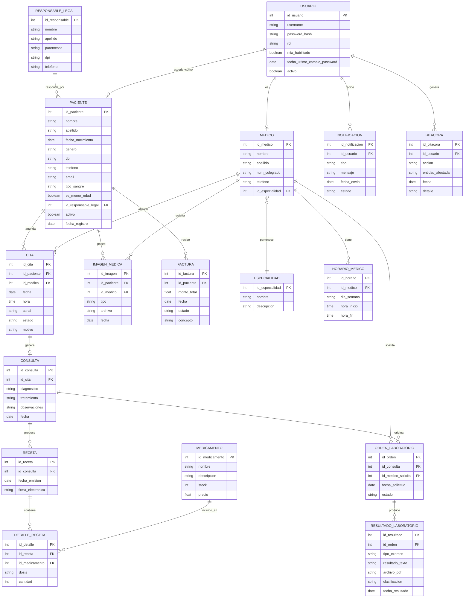

# Diseño ER — Sistema de Gestión Hospitalaria

## 1. Entidades

- **Paciente**: id_paciente (PK), nombre, apellido, fecha_nacimiento, genero, dpi, telefono, email, direccion, tipo_sangre, es_menor_edad, id_responsable_legal (FK, nullable), activo, fecha_registro
- **ResponsableLegal**: id_responsable (PK), nombre, apellido, parentesco, dpi, telefono
- **Medico**: id_medico (PK), nombre, apellido, num_colegiado, telefono, email, id_especialidad (FK)
- **Especialidad**: id_especialidad (PK), nombre, descripcion
- **HorarioMedico**: id_horario (PK), id_medico (FK), dia_semana, hora_inicio, hora_fin
- **Usuario**: id_usuario (PK), username, password_hash, rol [admin|medico|enfermeria|recepcion|paciente], mfa_habilitado, fecha_ultimo_cambio_password, activo
- **Cita**: id_cita (PK), id_paciente (FK), id_medico (FK), fecha, hora, canal [web|movil], estado [pendiente|confirmada|cancelada|atendida], motivo
- **Consulta**: id_consulta (PK), id_cita (FK), diagnostico, tratamiento, observaciones, fecha
- **Receta**: id_receta (PK), id_consulta (FK), fecha_emision, firma_electronica
- **Medicamento**: id_medicamento (PK), nombre, descripcion, stock, precio
- **DetalleReceta**: id_detalle (PK), id_receta (FK), id_medicamento (FK), dosis, cantidad
- **OrdenLaboratorio**: id_orden (PK), id_consulta (FK), id_medico_solicita (FK), fecha_solicitud, estado [pendiente|completada]
- **ResultadoLaboratorio**: id_resultado (PK), id_orden (FK), tipo_examen, resultado_texto, archivo_pdf, clasificacion [normal|critico], fecha_resultado
- **ImagenMedica**: id_imagen (PK), id_paciente (FK), id_medico (FK), tipo [radiografia|tomografia|otro], archivo, fecha
- **Factura**: id_factura (PK), id_paciente (FK), monto_total, fecha, estado [pendiente|pagada], concepto
- **Notificacion**: id_notificacion (PK), id_usuario (FK), tipo [email|sms], mensaje, fecha_envio, estado [enviado|pendiente|fallido]
- **Bitacora**: id_bitacora (PK), id_usuario (FK), accion, entidad_afectada, fecha, detalle

## 2. Diagrama ER (Mermaid)

> GitHub renderiza este bloque Mermaid automáticamente en la vista del `.md`. También puede pegarse en [mermaid.live](https://mermaid.live) para exportar como imagen.

## 3. Reglas de negocio reflejadas en el modelo

- RN01 (doble cita): restricción única en `Cita` sobre (id_medico, fecha, hora).
- RN02 (receta vigente): `DetalleReceta` solo puede crearse si la `Receta` asociada está vigente.
- RN03 (no borrado definitivo): `Paciente.activo` y equivalentes en otras entidades clínicas → borrado lógico.
- RN04 (menor de edad): `Paciente.es_menor_edad = true` obliga a `id_responsable_legal` no nulo.
- RN05 (médico ve solo sus pacientes): filtro por `id_medico` reforzado por rol en `Usuario`.
- RN06 (factura con pagos pendientes): validación antes de crear una `Factura` nueva.
- RN07 (factura pagada no modificable): validación de estado antes de actualizar una `Factura`.
