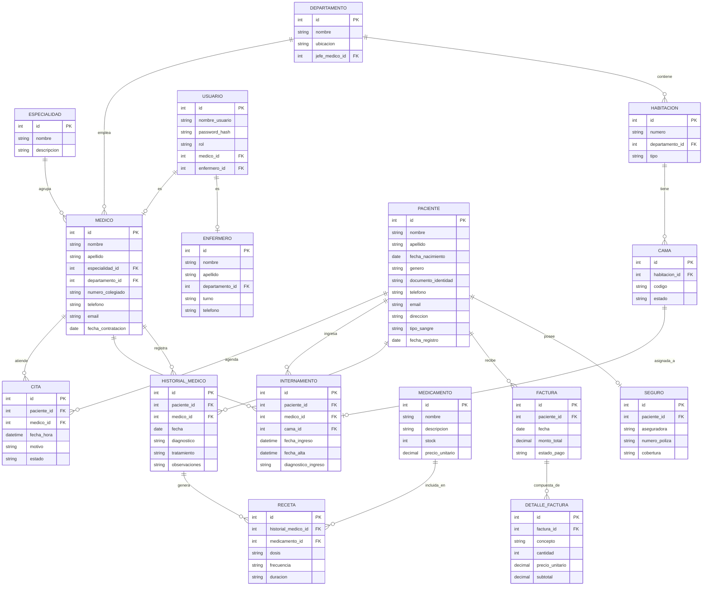

# Diseño ER — Sistema de Gestión Hospitalaria

## 1. Enfoque de diseño

El dominio se dividió en 6 áreas funcionales para que el modelo sea defendible en una revisión oral (no es solo "Paciente-Médico-Cita" genérico, sino que cubre el ciclo completo: consulta externa, internamiento, historial clínico, farmacia y facturación):

1. **Personal clínico** — Especialidad, Medico, Enfermero, Departamento
2. **Atención ambulatoria** — Cita
3. **Internamiento** — Habitacion, Cama, Internamiento
4. **Historial clínico** — HistorialMedico, Receta, Medicamento
5. **Facturación y seguros** — Factura, DetalleFactura, Seguro
6. **Acceso al sistema** — Usuario (login con roles)

Esta separación es justo lo que un profesor busca al pedir "requerimientos clasificados": que el modelo refleje procesos reales del hospital, no solo tablas sueltas.

## 2. Diagrama Mermaid (ER)

Pega esto tal cual en cualquier visor de Mermaid (mermaid.live, la extensión de VS Code, o directamente en Notion si tu plan lo soporta):

## 3. Decisiones de modelado que puedes explicar en la entrega

- **Cama vs Habitación**: se separaron porque una habitación puede tener varias camas (realismo hospitalario). El internamiento se asocia a la **cama**, no a la habitación completa.
- **Historial médico independiente de la cita/internamiento**: un registro clínico puede originarse en una consulta ambulatoria o durante un internamiento, así que se modeló como entidad propia en vez de duplicar campos en ambas.
- **Receta ligada al historial, no al paciente directamente**: evita recetas "flotantes" sin respaldo clínico — trazabilidad total (por qué se prescribió ese medicamento).
- **Usuario separado de Médico/Enfermero**: el login es un concepto de sistema, no clínico. Así un mismo empleado puede cambiar de rol sin tocar sus datos clínicos, y permite agregar roles como "Recepcionista" o "Administrador" sin forzar una fila médica falsa.
- **Normalización**: el modelo está en 3FN — no hay atributos derivados almacenados (ej. la edad no se guarda, se calcula desde `fecha_nacimiento`; el `monto_total` de factura podría auditarse contra la suma de `detalle_factura`, pero se mantiene desnormalizado por rendimiento, algo que puedes mencionar como decisión consciente, no error).
